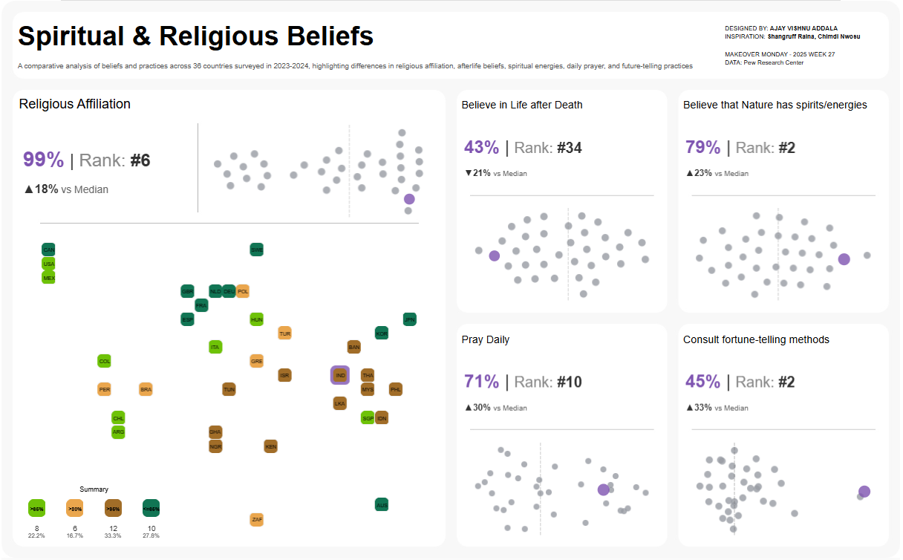

# Global Spirituality and Religion Analysis

This project is part of the **Makeover Monday Challenge** and visualizes survey data on spirituality and religion from 36 countries, including the U.S., collected during 2023-2024 by Pew Research Center. The visualization compares religious affiliation, beliefs in the afterlife, spiritual energies, daily prayer habits, and fortune-telling practices.

---

  
*Preview of the Tableau Dashboard*

[View the Full Dashboard on Tableau Public](https://public.tableau.com/shared/8K9584JBN?:display_count=n&:origin=viz_share_link)

---

## Table of Contents
- [Overview](#overview)
- [Data Source](#data-source)
- [Visualizations](#visualizations)
- [Features](#features)
- [Getting Started](#getting-started)
- [Contributing](#contributing)
- [License](#license)

## Overview
The project aims to provide an interactive, data-driven comparison of religious and spiritual beliefs across diverse countries. The visualizations highlight differences and similarities in practices and beliefs, offering a comprehensive global perspective.

## Data Source
The data used in this project is sourced from the Pew Research Center's surveys conducted in 2023 and 2024:
- **Original Report:** ["Spirituality and Religion: How Does the U.S. Compare With Other Countries"](https://www.pewresearch.org)  
- Includes responses from 36 countries, representing approximately 4 billion people.

## Visualizations
The Tableau dashboard includes:
1. **Religious Affiliation:** Percentage of adults identifying with a religion across countries.
2. **Belief in the Afterlife:** Percentage of adults who believe in life after death.
3. **Spiritual Energies in Nature:** Percentage of adults believing that parts of nature (mountains, rivers, etc.) have spirits.
4. **Daily Prayer:** Percentage of adults who pray daily.
5. **Future-Telling Practices:** Percentage of adults consulting horoscopes, fortune-tellers, or similar methods.

## Features
- Interactive filters for country and metric comparisons.
- Highlights for key observations (e.g., top-ranking countries for each metric).
- Insights into U.S. beliefs compared to other wealthy nations.

## Getting Started
### Prerequisites
- Tableau Desktop or Tableau Public (free) to open and interact with the visualization.
- Download the `.twb` file from this repository.

### Steps
1. Clone the repository:
   ```bash
   git clone https://github.com/yourusername/spirituality-and-religion-analysis.git
